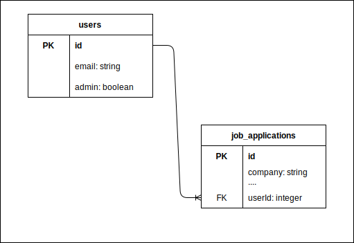
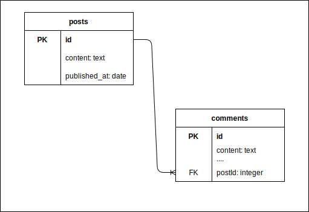
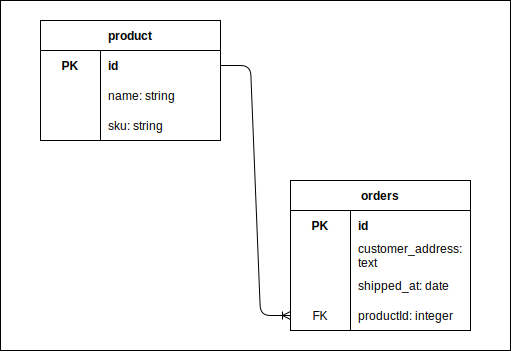
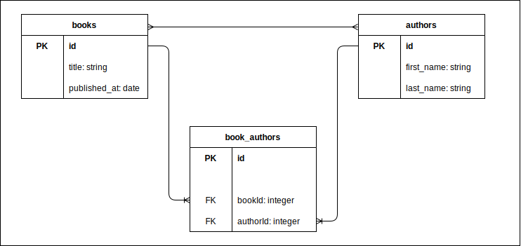
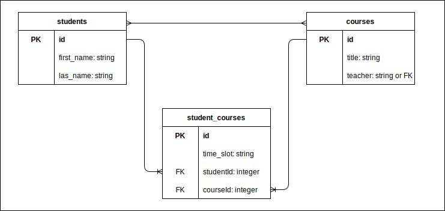
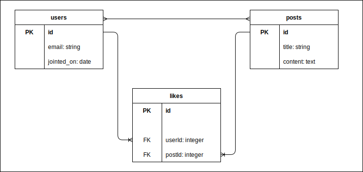

# Day 21: Node + Express Part 4: Understanding Database Relationships: One-to-Many and Many-to-Many Relationships

## Students Will Be Able To (SWBAT)

- Understand the concept of relational databases and their role in web development.
- Define and identify one-to-many and many-to-many relationships in databases.
- Implement these relationships using an ORM (Sequelize).
- Understand how to query and manipulate data in these relationships.

## Agenda

- Introduction to Relational Databases and Their Role in Web Development
- Understanding One-to-Many Relationships
- Understanding Many-to-Many Relationships
- Implementing One-to-Many and Many-to-Many Relationships in Sequelize
- Creating the "User" Resource (Model, Migration, Database Table, Relationships)
- Creating the "Tag" Resource (Model, Migration, Database Table)
- Creating the "JobApplicationTag" Resource (Model, Migration, Database Table)
- Establishing a Many-to-Many relationship between Tags and JobApplications
- Querying and Manipulating Data in Sequelize Relationships

### Introduction to Relational Databases and Their Role in Web Development

Relational databases are at the core of many web applications. They allow you to store, query, and manipulate data in a structured and scalable way.

1. **Example 1**: An e-commerce store uses a relational database to keep track of its products, customers, and orders.
2. **Example 2**: A blog website uses a relational database to store the articles, authors, and comments.
3. **Example 3**: A social networking site uses a relational database to store user profiles, posts, likes, and friend relationships.

### Understanding One-to-Many Relationships

In a one-to-many relationship, each record in one table can be associated with one or more records in another table.

1. **Example 1**: A user can have multiple job applications (one-to-many from users to job applications).
   
2. **Example 2**: A blog post can have many comments (one-to-many from blog posts to comments).
   
3. **Example 3**: A product can have many orders (one-to-many from products to orders).
   

You'll notice that in each of these cases, the use of a primary and foreign key relationship is how many rows in the child table can belong to one row in the parent table. Thus, the foreign key is always on the table for which one row can be associated with **just** one row in the other. The model we say has many of the other is opposite the foreign key.

### Understanding Many-to-Many Relationships

In a many-to-many relationship, multiple records in a table can be associated with multiple records in another table.

1. **Example 1**: A book can have multiple authors, and an author can write multiple books (many-to-many from books to authors).
   
2. **Example 2**: A student can take multiple courses, and a course can have multiple students (many-to-many from students to courses).
   
3. **Example 3**: A user can like many posts, and a post can be liked by many users (many-to-many from users to posts).
   

- You'll notice in all of these cases that there are 3 tables, one of which has two foreign keys and the others which have none.
- This is necessary because as we said before, we only store foreign keys on a table opposite a one to many relationship.
- In this case, because we have two tables that need to have multiple associated rows in the opposite table, we need a table in between (called a join table) that will serve to create the relationship between a single row in either table at a time.
- Each row in the join table establishes a relationship between a single row in each of the adjacent tables that have the many-to-many relationship.

## Implementing One-to-Many and Many-to-Many Relationships in Sequelize

This section discusses the essential aspect of relational databases, i.e., defining relationships between different tables/models. We'll be using Sequelize, a powerful Object-Relational Mapping (ORM) tool for Node.js, to illustrate how we can define and manage such relationships.

Sequelize provides several methods to define one-to-many and many-to-many relationships.

1. The `hasOne`, `hasMany`, `belongsTo`, and `belongsToMany` methods are used to set up one-to-many and many-to-many relationships.
2. The `through` option is used to specify a through model in a many-to-many relationship.
3. The `as` option is used to provide an alias for the associated model, which is especially helpful when the same model is associated more than once. We won't be demonstrating this here, but feel free to read the [bonus readme](<./USER_ADDRESS_EXAMPLE%20(AS).md>) for an example use case involving a user with multiple associated addresses, one for billing and one for shipping.

### Implementing a One-to-Many Relationship

Our first example relates to the relationship between `Users` and `JobApplications`. A single `User` can have multiple `JobApplications`, which translates to a One-to-Many relationship between these two entities.

Here's how we can define this in Sequelize:

```javascript
// models/user.js
const { Model } = require("sequelize");
module.exports = (sequelize, DataTypes) => {
  class User extends Model {
    static associate(models) {
      this.hasMany(models.JobApplication);
    }
  }
  User.init(
    {
      name: DataTypes.STRING,
      email: DataTypes.STRING,
      // ...
    },
    {
      sequelize,
      modelName: "User",
      tableName: "users",
    }
  );
  return User;
};
```

```javascript
// models/jobApplication.js
const { Model } = require("sequelize");
module.exports = (sequelize, DataTypes) => {
  class JobApplication extends Model {
    static associate(models) {
      this.belongsTo(models.User);
    }
  }
  JobApplication.init(
    {
      // Field definitions go here...
    },
    {
      sequelize,
      modelName: "JobApplication",
      tableName: "job_applications",
    }
  );
  return JobApplication;
};
```

Key points:

- `hasOne` and `hasMany` are used to set up one-to-many relationships. In this case, a User `hasMany` JobApplications.

### Implementing a Many-to-Many Relationship

To illustrate a Many-to-Many relationship, let's introduce another model, `Tag`, to our application. A `JobApplication` can have multiple `Tags` (Remote, In-Person, Hybrid, Contract, Part Time, etc.), and a `Tag` can be associated with multiple `JobApplications`.

In Sequelize, we implement a Many-to-Many relationship using a through model. In our case, we can use a model named `JobApplicationTag` as our through model.

Here's how we can define these relationships:

```javascript
// models/jobApplicationTag.js
const { Model } = require("sequelize");
module.exports = (sequelize, DataTypes) => {
  class JobApplicationTag extends Model {
    static associate(models) {
      // No additional associations needed here
    }
  }
  JobApplicationTag.init(
    {
      JobApplicationId: {
        type: DataTypes.INTEGER,
        primaryKey: true,
        references: {
          model: "JobApplication",
          key: "id",
        },
      },
      TagId: {
        type: DataTypes.INTEGER,
        primaryKey: true,
        references: {
          model: "Tag",
          key: "id",
        },
      },
    },
    {
      sequelize,
      modelName: "JobApplicationTag",
      tableName: "job_application_tags",
    }
  );
  return JobApplicationTag;
};
```

```javascript
// models/tag.js
const { Model } = require("sequelize");
module.exports = (sequelize, DataTypes) => {
  class Tag extends Model {
    static associate(models) {
      this.belongsToMany(models.JobApplication, {
        through: "job_application_tags",
      });
    }
  }
  Tag.init(
    {
      name: DataTypes.STRING,
    },
    {
      sequelize,
      modelName: "Tag",
      tableName: "tags",
    }
  );
  return Tag;
};
```

```javascript
// models/jobApplication.js
const { Model } = require("sequelize");
module.exports = (sequelize, DataTypes) => {
  class JobApplication extends Model {
    static associate(models) {
      // Previous associations...
      this.belongsToMany(models.Tag, {
        through: "JobApplicationTag",
      });
    }
  }
  JobApplication.init(
    {
      // Field definitions go here...
    },
    {
      sequelize,
      modelName: "JobApplication",
      tableName: "job_applications",
    }
  );
  return JobApplication;
};
```

Key points:

- `belongsToMany` is used to set up many-to-many relationships.
- The `through` option is used to specify a through model in a many-to-many relationship. The name of the through model is written in snake_case to follow Sequelize's naming conventions.
- Our `JobApplicationTag` model does not require additional associations. It only contains foreign key references to `JobApplication` and `Tag` models.

Now that we've got an overview of how this works, let's get to implementing it in our project step by step.

## Creating the "User" Resource (Model, Migration, Database Table, Relationships)

In this section, we will generate a User model, create the associated migration file, update these files as necessary, and run the migration to create a Users table in our database.

### Tasks to Complete

Here is a breakdown of the tasks we need to complete:

1. Generate the User model and migration file.
2. Update the User model file.
3. Update the migration file.
4. Run the migration to create the Users table in our database.

### Step 1: Generate the User model and migration file

We will start by running the Sequelize CLI command to generate a model along with its migration file:

```bash
npx sequelize-cli model:generate --name User --attributes name:string,email:string
```

This command does two things:

- Creates a model file `user.js` in the `/models` directory.
- Creates a migration file in the `/migrations` directory. The migration filename will start with a timestamp and include the model name, e.g., `XXXXXXXXXXXXXX-create-user.js`.

### Step 2: Update the User Model File

Let's update our model file (`/models/user.js`) to specify the `tableName` to adhere to the snake_case naming convention:

```javascript
"use strict";
const { Model } = require("sequelize");
module.exports = (sequelize, DataTypes) => {
  class User extends Model {
    /**
     * Helper method for defining associations.
     * This method is not a part of Sequelize lifecycle.
     * The `models/index` file will call this method automatically.
     */
    static associate(models) {
      // define association here
    }
  }
  User.init(
    {
      name: DataTypes.STRING,
      email: DataTypes.STRING,
    },
    {
      sequelize,
      modelName: "User",
      tableName: "users",
    }
  );
  return User;
};
```

### Step 3: Update the Migration File

Now let's update our migration file (`/migrations/XXXXXXXXXXXXXX-create-user.js`) to adhere to the snake_case naming convention and to define the columns we want. We'll need to:

- rename the table from `"Users"` to `"users"` (in both up and down!)
- rename the `updatedAt` and `createdAt` columns to snake cased: `updatedAt` and `createdAt`

```javascript
// migrations/XXXXXXXXXXXXXX-create-user.js
"use strict";
/** @type {import('sequelize-cli').Migration} */
module.exports = {
  async up(queryInterface, Sequelize) {
    await queryInterface.createTable("users", {
      id: {
        allowNull: false,
        autoIncrement: true,
        primaryKey: true,
        type: Sequelize.INTEGER,
      },
      name: {
        type: Sequelize.STRING,
      },
      email: {
        type: Sequelize.STRING,
      },
      createdAt: {
        allowNull: false,
        type: Sequelize.DATE,
      },
      updatedAt: {
        allowNull: false,
        type: Sequelize.DATE,
      },
    });
  },
  async down(queryInterface, Sequelize) {
    await queryInterface.dropTable("users");
  },
};
```

### Step 4: Run the Migration to Create the Users Table

Finally, we can run our migration using the Sequelize CLI:

```bash
npx sequelize-cli db:migrate
```

This command will create the `users` table in our database according to the specifications we made in our migration file.

### Verifying the Table Creation

With the PostgreSQL extension for Visual Studio Code, you can connect to your local database and check if the `users` table has been created successfully.

That wraps up the creation of the User resource. In the next sections, we will create the remaining resources and define relationships between them.

## Setting Up a One-to-Many Relationship between Users and JobApplications

In this section, we will establish a one-to-many relationship between `Users` and `JobApplications`. This relationship implies that each `User` can have multiple `JobApplications`, but each `JobApplication` can only belong to one `User`.

## Tasks to Complete

Here are the steps to accomplish this:

1. Update the `User` model to define the association with `JobApplication`.
2. Update the `JobApplication` model to define the association with `User`.
3. Generate a new migration to add the foreign key `userId` in the `job_applications` table.
4. Run the new migration.

### Step 1: Update the User Model

In our User model (`/models/user.js`), we define that a User can have multiple JobApplications. Sequelize provides the `hasMany` method for this:

```javascript
// models/user.js
static associate(models) {
  this.hasMany(models.JobApplication);
}
```

### Step 2: Update the JobApplication Model

Then, in our `JobApplication` model (`/models/job_application.js`), we specify that a `JobApplication` belongs to a `User`. Sequelize provides the `belongsTo` method for this:

```javascript
// models/job_application.js
static associate(models) {
  this.belongsTo(models.User);
}
```

### Step 3: Generate a New Migration

Now, we need to generate a new migration to add the `userId` foreign key in the `job_applications` table. We can create a new migration file with this command:

```bash
npx sequelize-cli migration:generate --name add-user-id-to-job-applications
```

This will create a new file in the `migrations` folder. We'll then update that file as follows:

```javascript
// migrations/XXXXXXXXXXXXXX-add-user-id-to-job-applications.js
"use strict";
module.exports = {
  async up(queryInterface, Sequelize) {
    await queryInterface.addColumn("job_applications", "userId", {
      type: Sequelize.INTEGER,
      references: {
        model: "users", // you can use the table name here
        key: "id",
      },
      onUpdate: "CASCADE",
      onDelete: "SET NULL",
    });
  },
  async down(queryInterface, Sequelize) {
    await queryInterface.removeColumn("job_applications", "userId");
  },
};
```

Note here the use of the [`queryInterface`](https://sequelize.org/docs/v6/other-topics/query-interface/) object to add the foreign key column within the `up` method and to remove it within the `down` method. This object is useful within migration files. The official documentation contains examples of the common use cases for which queryInterface is used:

[Sequelize Docs - queryInterface](https://sequelize.org/docs/v6/other-topics/query-interface/)

In our case, there are a few options that we're specifying here. The `references` option in a Sequelize migration is used to establish a foreign key relationship with another table. The `onUpdate` and `onDelete` options in migrations define the behavior of the foreign key when the associated data is updated or deleted.

Let's expand upon this:

1. The `references` option is an object that has two properties: `model` and `key`.

   - `model`: This property refers to the name of the table that the foreign key is linked to. It's the table where the referenced primary key is located. For example, in our `job_applications` table, the `userId` field references the `users` table, hence `model: "users"`.

   - `key`: This property refers to the specific field on the referenced table that our foreign key corresponds to. Typically, this is the primary key of the referenced table. In most cases, this will be `id`, as it is in our `job_applications` table with `key: "id"`.

   Using the `references` option is crucial when setting up relations in Sequelize, as it enforces referential integrity at the database level. This means the database itself ensures that relationships between tables remain consistent. When you create a foreign key with a reference, the database won't allow you to add a record that references a non-existent record, or delete a record that other records still reference.

2. `onUpdate`: This defines what happens when the primary key that the foreign key is referencing (in this case, the `id` on the `users` table) is updated. The `CASCADE` option means that when a primary key is updated, the foreign key will also be updated to reflect this change. This ensures that the relationship between the tables remains consistent.

3. `onDelete`: This defines what happens when the primary key that the foreign key is referencing is deleted. The `SET NULL` option means that if a record in the `users` table is deleted, the `userId` in the `job_applications` table will be set to `NULL`. This is often used when you want to keep the child record (in this case, the job application), but remove the association with the parent record (the user).

   Other options for `onUpdate` and `onDelete` could be `RESTRICT`, `NO ACTION`, or `SET DEFAULT`, depending on your application's needs and how you want to handle these situations. It's important to select these options carefully based on the logic and rules of your application's data structure and workflow.

### Step 4: Run the New Migration

We can now run our new migration to add the `userId` foreign key to the `job_applications` table:

```bash
npx sequelize-cli db:migrate
```

## Verification

With the PostgreSQL extension for Visual Studio Code, you can connect to your local database and check if the `userId` foreign key has been added to the `job_applications` table.

## Creating the "Tag" Resource (Model, Migration, Database Table)

### Overview

In this section, we will go through the steps to create the `Tag` resource. The `Tag` resource will represent labels that we can associate with our `JobApplication` resources to better categorize them. The steps involve creating the `Tag` model and migration, and then running the migration to create the database table. This resource will be one edge of a many-to-many relationship that we're adding to our domain model.

### Tasks

1. Generate a new Sequelize model and migration for `Tag`.
2. Edit the `Tag` model file to define the fields and their data types.
3. Edit the `Tag` migration file to mirror the fields defined in the model.
4. Run the migration to create the `Tag` table in your database.

### Steps

1. **Generate the `Tag` model and migration**

   We will start by using the Sequelize CLI to generate a new model and corresponding migration for `Tag`. This can be done using the `model:generate` command.

   ```
   npx sequelize-cli model:generate --name Tag --attributes name:string
   ```

   This command will generate two new files:

   - `models/tag.js` — This is where we define the model.
   - `migrations/XXXXXX-create-tag.js` — This is the migration file to create the `Tag` table.

2. **Edit the `Tag` model file**

   Open the `models/tag.js` file that was created in the previous step.

   Update the `Tag` model definition to follow the new Sequelize v6 syntax.

   Here is how your `Tag` model should look like:

   ```javascript
   "use strict";
   const { Model } = require("sequelize");
   module.exports = (sequelize, DataTypes) => {
     class Tag extends Model {
       static associate(models) {
         // define association here
       }
     }
     Tag.init(
       {
         name: DataTypes.STRING,
       },
       {
         sequelize,
         modelName: "Tag",
         tableName: "tags",
       }
     );
     return Tag;
   };
   ```

3. **Edit the `Tag` migration file**

   Next, open the `migrations/XXXXXX-create-tag.js` file. You will notice that the filename begins with a timestamp and the rest of the filename is a kebab-case representation of the model's name.

   - update the table name to lower snake case plural: "Tags" => "tags"
   - Modify the `up` method to include the `name` attribute with the same definition as in the model file. (`allowNull: false`)
   - rename `updatedAt` and `createdAt` properties to `updatedAt` and `createdAt`

   The migration file should look something like this:

   ```javascript
   "use strict";
   /** @type {import('sequelize-cli').Migration} */
   module.exports = {
     async up(queryInterface, Sequelize) {
       await queryInterface.createTable("tags", {
         id: {
           allowNull: false,
           autoIncrement: true,
           primaryKey: true,
           type: Sequelize.INTEGER,
         },
         name: {
           type: Sequelize.STRING,
           allowNull: false,
         },
         createdAt: {
           allowNull: false,
           type: Sequelize.DATE,
         },
         updatedAt: {
           allowNull: false,
           type: Sequelize.DATE,
         },
       });
     },
     async down(queryInterface, Sequelize) {
       await queryInterface.dropTable("tags");
     },
   };
   ```

4. **Run the migration**

   Finally, run the migration using the Sequelize CLI `db:migrate` command to create the `tags` table in your database.

   ```
   npx sequelize-cli db:migrate
   ```

   You can use the PostgreSQL extension for VS Code to verify that the `tags` table was created successfully.

And that's it! You've now created the `Tag` resource complete with model, migration, and database table.

## Creating the `JobApplicationTag` Resource

In this section, we'll create a new resource, the `JobApplicationTag`, which represents the many-to-many relationship between `JobApplications` and `Tags`. The `JobApplicationTag` resource will serve as a join table linking these two resources.

## Tasks:

1. Generate the model and migration for `JobApplicationTag`
2. Update the model and migration to include references to `JobApplication` and `Tag`
3. Run the migration to create the `JobApplicationTag` table in the database
4. Verify the creation of the table using the PostgreSQL extension for VSCode

## Step-by-Step Instructions:

1. **Generate the model and migration for `JobApplicationTag`:**

   Use the Sequelize CLI command to generate the model and associated migration. We need two fields for this model: `JobApplicationId` and `TagId`, both of which are integers.

   ```bash
   npx sequelize-cli model:generate --name JobApplicationTag --attributes JobApplicationId:integer,TagId:integer
   ```

   This command will generate the `JobApplicationTag` model in your `models` folder and a migration file in your `migrations` folder.

2. **Update the model and migration to include references to `JobApplication` and `Tag`:**

   In your `JobApplicationTag` model file, make the following adjustments:

   - rename `JobApplicationId` to `JobApplicationId` and `TagId` to `TagId`
   - make each of those fields point to an object with type Integer, add `references` to each of those fields with the name of the table the foreign key points to and `key: "id"`
   - add `allowNull: false` to both of the fields as well
   - add the `tableName` option to specify lower snake case plural for the database table name.

   The field should look as follows when finished.

   ```javascript
   "use strict";
   const { Model } = require("sequelize");
   module.exports = (sequelize, DataTypes) => {
     class JobApplicationTag extends Model {
       static associate(models) {
         // define association here
       }
     }
     JobApplicationTag.init(
       {
         JobApplicationId: {
           type: DataTypes.INTEGER,
           references: {
             model: "job_applications",
             key: "id",
           },
           allowNull: false,
         },
         TagId: {
           type: DataTypes.INTEGER,
           references: {
             model: "tags",
             key: "id",
           },
           allowNull: false,
         },
       },
       {
         sequelize,
         modelName: "JobApplicationTag",
         tableName: "job_application_tags",
       }
     );
     return JobApplicationTag;
   };
   ```

   In your `JobApplicationTag` migration file, make the following adjustments:

   - rename the table to `job_application_tags` in both the `up` and `down` methods.
   - to the `JobApplicationId` and `TagId` columns, add the `allowNull: false` constraint and `onDelete` and `onUpdate` options both set to `"CASCADE"`
   - add `references` to the `JobApplicationId` where the `model` is `"job_applications"` and the `key` is `"id"`
   - add `references` to the `TagId` where the `model` is `"tags"` and the `key` is `"id"`
   - rename the `createdAt` and `updatedAt` columns to `createdAt` and `updatedAt`

   When complete, it should look like this:

   ```javascript
   "use strict";
   /** @type {import('sequelize-cli').Migration} */
   module.exports = {
     async up(queryInterface, Sequelize) {
       await queryInterface.createTable("job_application_tags", {
         id: {
           allowNull: false,
           autoIncrement: true,
           primaryKey: true,
           type: Sequelize.INTEGER,
         },
         JobApplicationId: {
           type: Sequelize.INTEGER,
           allowNull: false,
           onDelete: "CASCADE",
           onUpdate: "CASCADE",
           references: {
             model: "job_applications",
             key: "id",
           },
         },
         TagId: {
           type: Sequelize.INTEGER,
           allowNull: false,
           onDelete: "CASCADE",
           onUpdate: "CASCADE",
           references: {
             model: "tags",
             key: "id",
           },
         },
         createdAt: {
           allowNull: false,
           type: Sequelize.DATE,
         },
         updatedAt: {
           allowNull: false,
           type: Sequelize.DATE,
         },
       });
     },
     async down(queryInterface, Sequelize) {
       await queryInterface.dropTable("job_application_tags");
     },
   };
   ```

   Here, the `references` option is used to specify the foreign key constraint in our "job_application_tags" table. `onUpdate: 'CASCADE'` means that when the referenced "job_applications" or "tags" is updated, the change will cascade down to the "job_application_tags" table. `onDelete: 'CASCADE'` means that when the referenced "job_applications" or "tags" is deleted, the deletion will cascade down to the "job_application_tags" table.

3. **Run the migration to create the `JobApplicationTag` table in the database:**

   Run the Sequelize CLI command to execute the migration:

   ```bash
   npx sequelize-cli db:migrate
   ```

4. **Verify the creation of the table using the PostgreSQL extension for VSCode:**

   Open your PostgreSQL extension in VSCode and refresh the database. You should now see the "job_application_tags" table in the list of tables for your database.

That's it! You've successfully created the `JobApplicationTag` resource. This table will play a crucial role in establishing the many-to-many relationship between "JobApplications" and "Tags".

# Establishing a Many-to-Many relationship between `Tags` and `JobApplications`

In this section, we'll establish a many-to-many relationship between `Tags` and `JobApplications` using the `JobApplicationTag` model we just created.

## Tasks:

1. Update the `JobApplication` and `Tag` models to include a many-to-many association through the `JobApplicationTag` model
2. Create a "repl.js" file to interact with your models from the command line
3. Update your "package.json" file to include a new script for running your repl
4. Test the many-to-many relationship in the repl

## Step-by-Step Instructions:

1. **Update the `JobApplication` and `Tag` models to include a many-to-many association through the `JobApplicationTag` model.**

   In your `JobApplication` model, update the `associate` function:

   ```javascript
   static associate(models) {
     this.belongsTo(models.User);
     this.belongsToMany(models.Tag, {
       through: 'JobApplicationTag'
     });
   }
   ```

   And in your `Tag` model, add an `associate` function:

   ```javascript
   static associate(models) {
     this.belongsToMany(models.JobApplication, {
       through: 'JobApplicationTag'
     });
   }
   ```

2. **Create a "repl.js" file to interact with your models from the command line.**

   Create a new "repl.js" file in your root directory, and add the following code:

   ```javascript
   const repl = require("repl");
   const db = require("./models");

   const replServer = repl.start({
     prompt: "job-app-tracker > ",
   });

   for (let modelName in db) {
     replServer.context[modelName] = db[modelName];
   }

   // a function to take the return value of `findAll()`
   // and convert it to an array of objects
   function asArray(collection) {
     return Array.from(collection).map((record) => record.get({ plain: true }));
   }
   // a function to take the return of a `findOne()`
   // and convert it to a plain object
   function asObject(record) {
     return record.get({ plain: true });
   }
   replServer.context.asArray = asArray;
   replServer.context.asObject = asObject;
   ```

   This script uses the `repl` module that comes with Node.js to start a REPL. It then imports your Sequelize models and attaches them to the `context` of the REPL server, which makes them globally accessible from within the REPL.

3. **Update your "package.json" file to include a new script for running your repl.**

   Add a new "console" script to the "scripts" section of your "package.json" file:

   ```json
   "scripts": {
     "console": "node repl.js",
     ...
   }
   ```

   Now you can start the REPL with the following command:

   ```bash
   npm run console
   ```

4. **Test the many-to-many relationship in the repl.**

   Now you can start the REPL and interact with your models to test out the many-to-many relationship.

   Here are some commands you can run and their expected outputs:

   - Find a job application with its `tags`:

     ```javascript
     let jobApplication = await JobApplication.findOne({ include: Tag });
     console.log(jobApplication.Tags);
     ```

     Expected output: an array of Tag instances associated with the JobApplication with id 1.

   - Create a Tag and add it to a job application:

     ```javascript
     let tag = await Tag.findOne();
     await JobApplicationTag.create({
       JobApplicationId: jobApplication.id,
       TagId: tag.id,
     });
     jobApplication = await JobApplication.findOne({ include: Tag });
     console.log(asArray(jobApplication.Tags));
     ```

     No output is expected here. After running these commands, the Tag with id 1 will be associated with the JobApplication with id 1. You can verify this by running the first command again to see that the JobApplication now includes the new Tag.

   - Find a tag with its job applications:

     ```javascript
     tag = await Tag.findOne({
       include: JobApplication
     });
     console.log(asArray(tag.JobApplications));
     ```

     Expected output: an array of JobApplication instances associated with the Tag with id 1.

These commands allow you to verify that your many-to-many relationship between `Tags` and `JobApplications` is working correctly. With the help of the REPL, you can interactively explore and experiment with your models and their relationships.


## Key Takeaways

| Concept                    | Description                                                                                    | Example                                                                                   |
| -------------------------- | ---------------------------------------------------------------------------------------------- | ----------------------------------------------------------------------------------------- |
| Relational Databases       | They store data in a structured way and allow efficient querying and manipulation.             | An e-commerce store uses a relational database to manage products, customers, and orders. |
| One-to-Many Relationships  | Each record in one table can be associated with multiple records in another table.             | A user can have multiple job applications.                                                |
| Many-to-Many Relationships | Multiple records in one table can be associated with multiple records in another table.        | A user can like many posts, and a post can be liked by many users.                        |
| Sequelize Relationships    | Sequelize provides methods to define and work with one-to-many and many-to-many relationships. | `hasOne`, `hasMany`, `belongsTo`, and `belongsToMany` methods in Sequelize.               |

## Resources

- [Sequelize Documentation on associations](https://sequelize.org/master/manual/assocs.html)
- [Relational Databases: An Overview](https://www.ibm.com/cloud/learn/relational-databases)
- [Database Relationships: One-to-Many and Many-to-Many](https://www.databaseprimer.com/pages/relationship_1toMany/)
